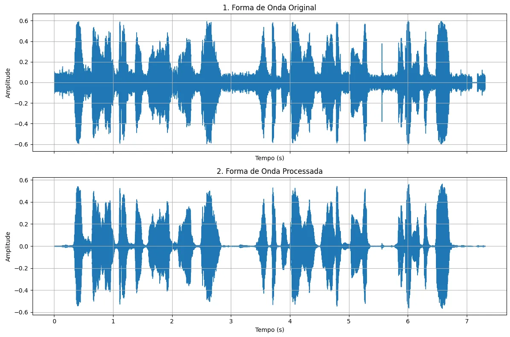
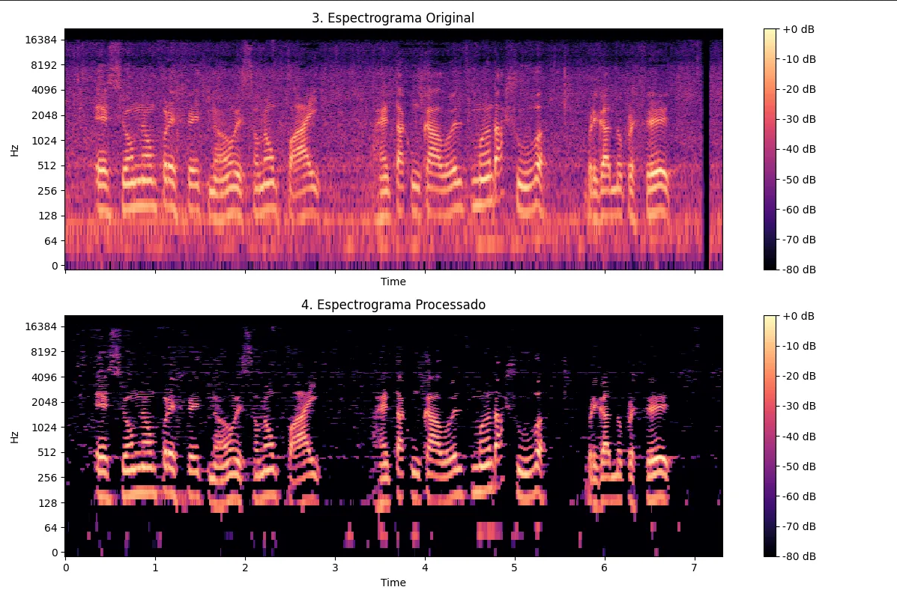
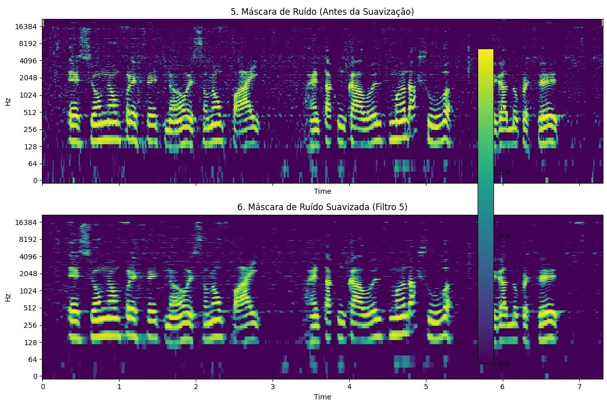

# signal-denoising-with-STFT
Aplicação prática da Transformada de Fourier para a redução de ruído em áudio. Utilizando a Transformada de Fourier de Tempo Curto (STFT), o sinal é convertido do domínio do tempo para o domínio da frequência, permitindo a análise e manipulação de seu conteúdo espectral. Nesse domínio, um perfil de ruído é estimado a partir de um trecho inicial do áudio e a técnica de subtração espectral é aplicada por meio de uma máscara suave (soft mask). Essa abordagem atenua o ruído de forma mais natural comparado com uma máscara binária. Depois o sinal de áudio limpo é reconstruído no domínio do tempo com o uso da Transformada Inversa de Tempo Curto (iSTFT).

