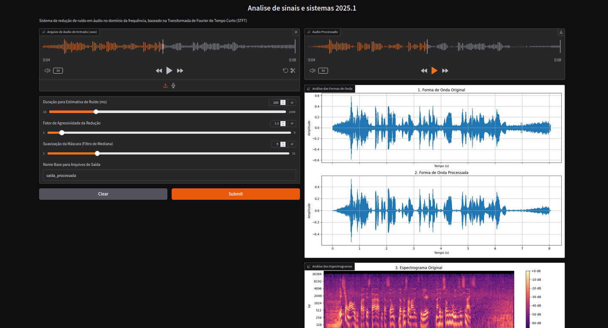
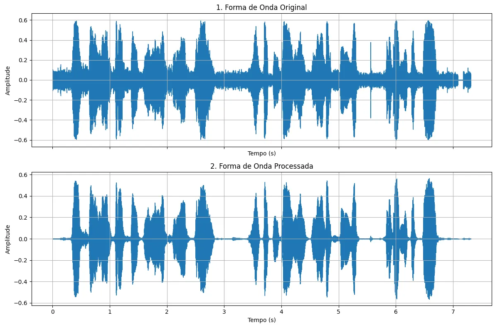
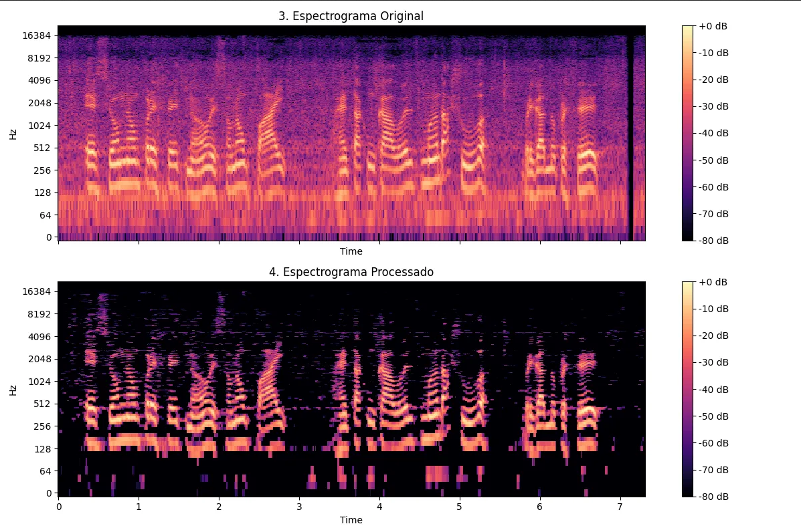
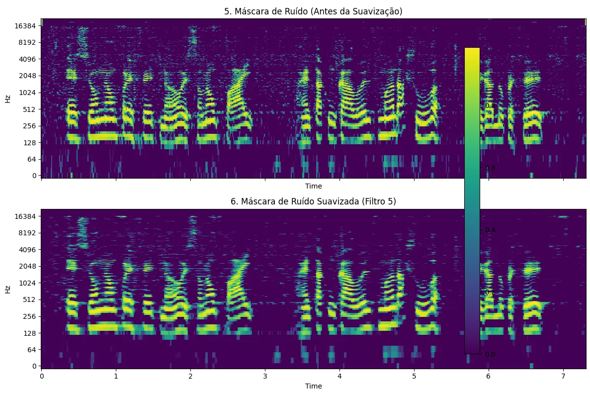

# **Redução de Ruído em Sinais com STFT**

Aplicação prática da Transformada de Fourier para redução de ruído em sinais de áudio.

## Descrição

Este projeto implementa uma técnica de redução de ruído baseada na análise espectral do sinal. O sinal de áudio é transformado do domínio do tempo para o domínio da frequência utilizando a STFT, permitindo uma análise detalhada dos componentes espectrais.

A partir de um trecho inicial do áudio, é estimado o perfil de ruído. Com essa estimativa, aplicamos a técnica de subtração espectral por meio de uma máscara suave (soft mask), que atenua o ruído de forma mais natural e menos agressiva do que uma máscara binária. Após o processamento, o sinal é reconstruído no domínio do tempo utilizando a Transformada Inversa de Fourier de Tempo Curto (iSTFT).

## Objetivo

Este trabalho foi desenvolvido como parte da disciplina de Análise de Sinais e Sistemas, sob orientação da professora Ana Julia Fernandes de Oliveira Barros, com o objetivo de aplicar conceitos teóricos de análise no domínio da frequência em um problema prático de processamento de sinais.

## Integrantes do grupo

* David Levy Cavalcanti de Sá
* Gabriel Shoji Sasaki Budoia
* Matheus Vinicius Rodrigues Valadares Barros
* Stharley Santos Leite
* Paulo Henrique Torres e Silva

## Tecnologias utilizadas

* Python
* NumPy
* SciPy
* Librosa
* Matplotlib

## Como executar

Siga os passos abaixo para rodar o projeto localmente:

1. **Clone este repositório:**

```bash
git clone https://github.com/seu-usuario/signal-denoising-with-STFT.git
cd signal-denoising-with-STFT
```

2. **Crie um ambiente virtual Python:**

```bash
python -m venv venv
```

3. **Ative o ambiente virtual:**

* No Windows (PowerShell):

```bash
.\venv\Scripts\Activate.ps1
```

* No Windows (Prompt de Comando):

```bash
.\venv\Scripts\activate.bat
```

* No macOS/Linux:

```bash
source venv/bin/activate
```

4. **Instale as dependências do projeto:**

```bash
pip install -r requirements.txt
```

5. **Execute o script principal:**

```bash
python main.py
```

6. **Acesse a interface:**

Abra o navegador e entre no endereço exibido no terminal (normalmente [http://127.0.0.1:7860](http://127.0.0.1:7860)).


### Exemplos de saída:

**Interface**


**Formas de Onda (Original vs Processado)**  


**Espectrogramas (Original vs Processado)**  


**Máscaras de Atenuação (Antes e Depois da Suavização)**  



